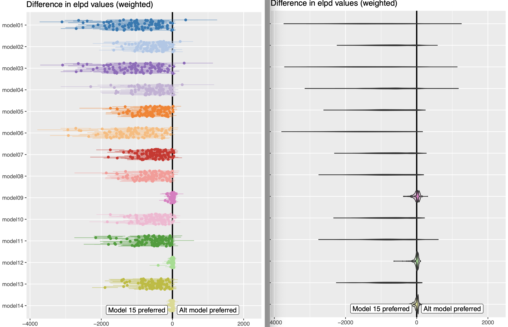
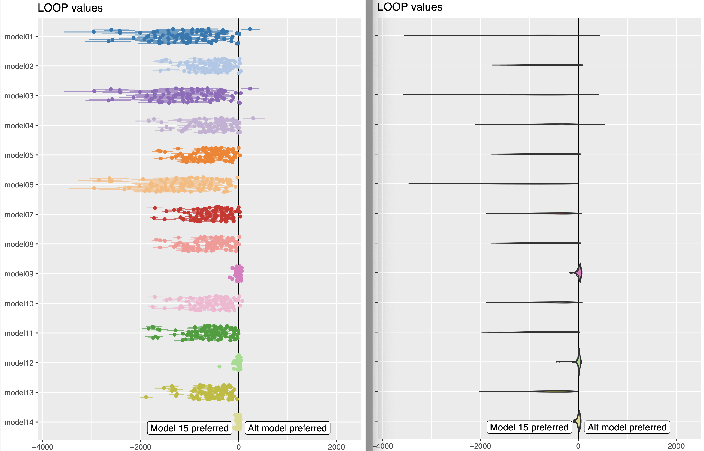
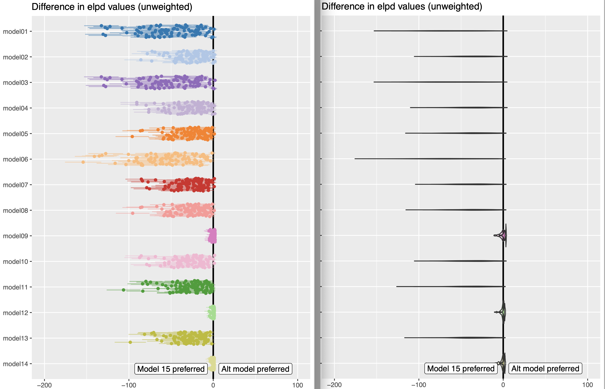
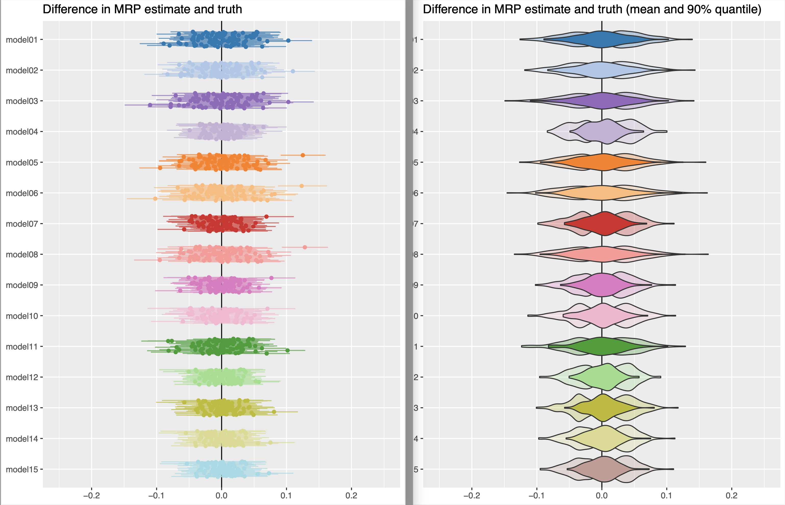
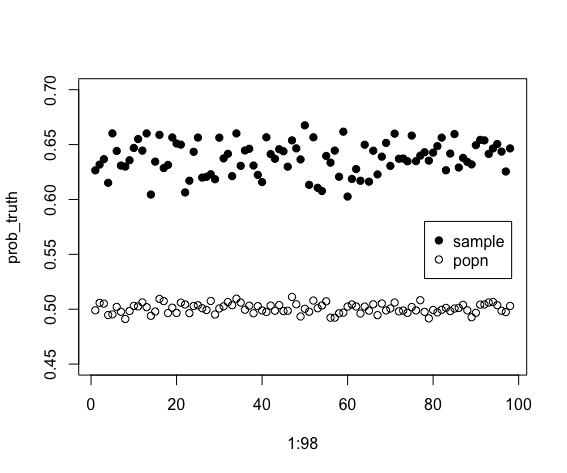
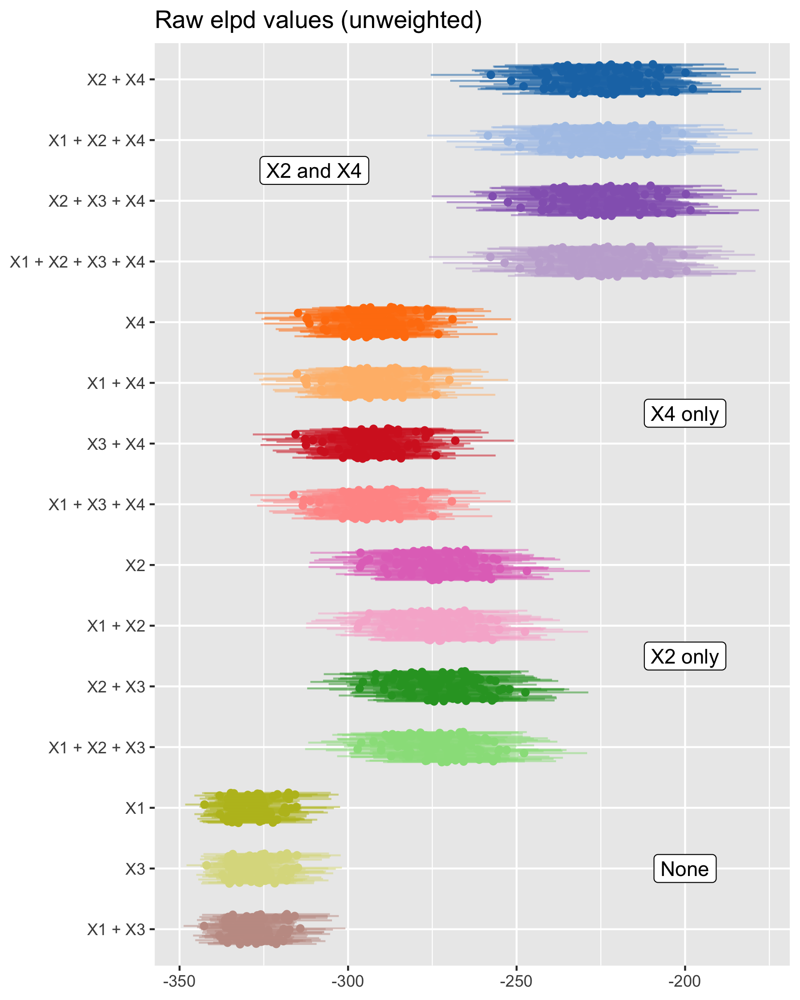
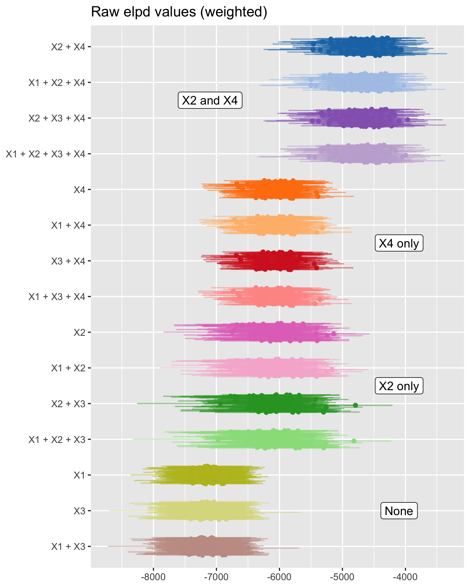
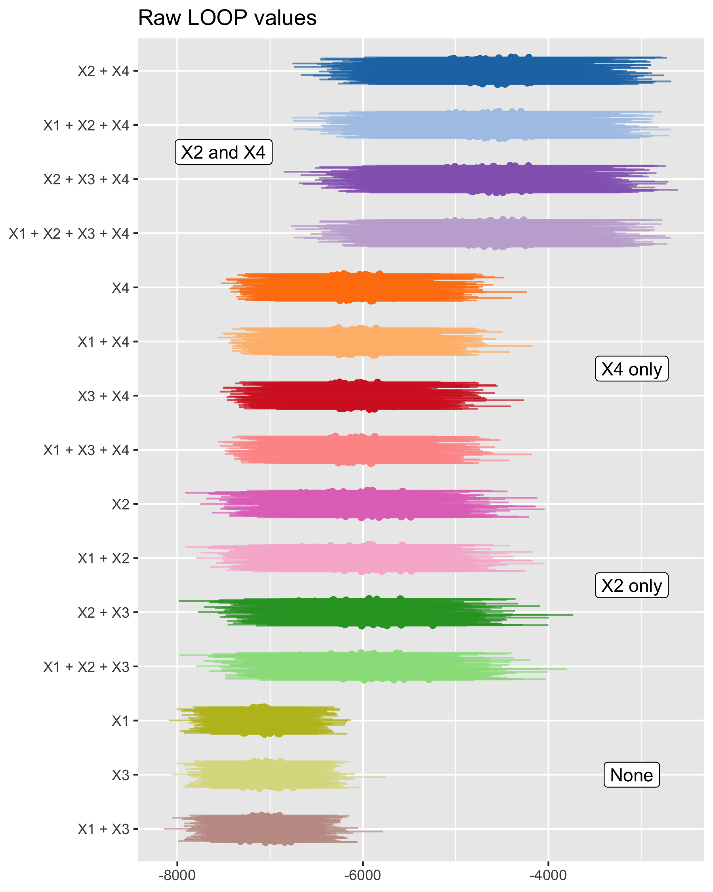
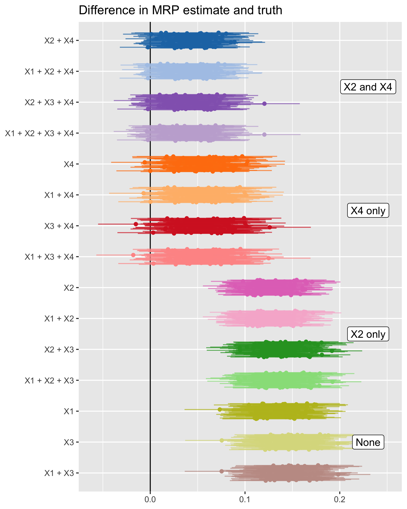
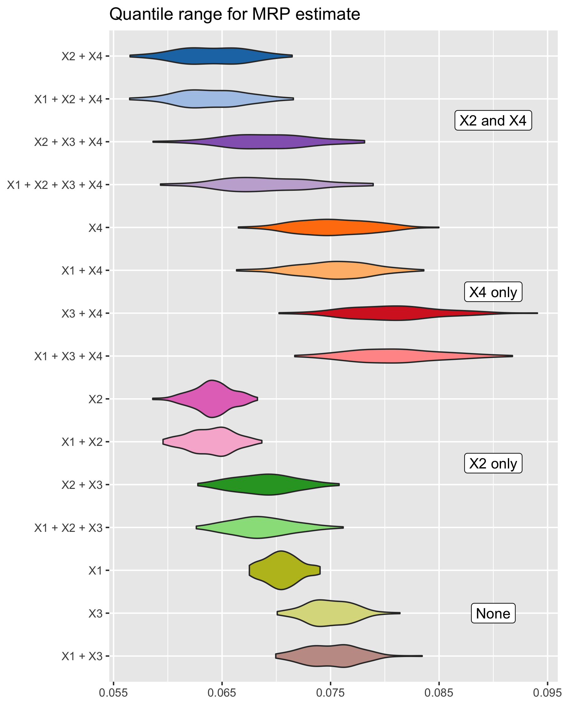

<!-- ## Simulation 3b - Different priors -->

# Simulation 2 
## Super-population approach
Now, we have the above code in the for-loop, generating different population and samples from that population each time. 

In addition, we also introduced '`LOOP`' -- a weighted loo estimate by weighting using the MRP estimates. 

### **Using LOO**: 
This time with a super-population approach, the trend is a bit clearer to what we have expected. Models with $X_2$ and $X_4$ (models #9, #12, #14) are slightly preferred when compared to the full model (model #15) with all the variables $X_1, X_2, X_3, X_4$. That means with the variables that are strongly predictive of the outcome and survey response, we do not need the variables that are weakly predictive. The results are the same whether we use `loo`, `wtd_loo`, or `LOOP`. 





### **Using MRP estimates**: 
When we assess the model performance based on its predictive power of the (binary) outcome, we can see that any model with $X_4$ in it (models #4, #7, #9, #10, #11, #12, #13, #14, #15) has less uncertainty in the biases. 



> LOO suggests equivalence of any models with $X_2 + X_4$ $\leftrightarrow$ \newline MRP estimates: models with $X_4$ ?

# Simulation 2b
## Super-population approach with continuous covariates

Now instead of generating the outcome using discrete covariates, we generate the outcome variable using the continuous covariates so that it has a stronger relationship with the outcome. 

We have also sampled part of the data using 'brute-force', by making sure we sample at least one from each level of covariate, so that we don't run into issue when calculating the weights. 

```{r eval=F}
## generating 5 continuous predictors/covariates
N = 10000

## generating a binary outcome 
# weakly predictive - 0.1 (sd), strongly predictive - 1 (sd)
set.seed(65438)
pn = 100 # number of population
seed = round(runif(pn, min=10, max=100000),0) # fixed seed number

for (i in 1:ITE){
 set.seed(seed[i])
  popn_data <- data.frame(X1_cont = rnorm(N, 0, 2), 
                          X2_cont = rnorm(N, 0, 2),
                          X3_cont = rnorm(N, 0, 2), 
                          X4_cont = rnorm(N, 0, 2))
  
  
  wkly1 = 0.1
  strg1 = 1
  
  ## generating continuous and binary outcome
  popn_data$outcome <- inv_logit_scaled(wkly1*popn_data$X1_cont +
                                          strg1*popn_data$X2_cont +
                                          wkly1*popn_data$X3_cont +
                                          strg1*popn_data$X4_cont)
  popn_data$bin_value <- rbinom(N,1,popn_data$outcome)
  
  
  ## generate inclusion prob. for each individual
  # weakly predictive - 0.1 (sd), strongly predictive - 1 (sd)
  wkly2 = 0.1
  strg2 = 1
  popn_data$incl_prob <- inv_logit_scaled(wkly2*popn_data$X1_cont + 
                                            wkly2*popn_data$X2_cont + 
                                            strg2*popn_data$X3_cont +
                                            strg2*popn_data$X4_cont)
```


<center>
{width=300px}
</center>

If we look at the unweighted elpd LOO values, models #9,12,14 (the ones with both $X_2$ and $X_4$) are preferred, followed by the models with $X_2$ in it, then with $X_4$, and finally the ones with $X_1$ and $X_3$ only) are distinctively 'un-preferred'. But we have higher precision for the the LOO estimates using just $X_4$ only. 

If we weigh the elpd values, the distinctions between using $X_4$ and $X_2$ only models decreases. 

We see similar conclusion by looking at the LOOP values (adjust using MRP).

{width=450px} {width=450px}

{width=450px}

If we look at the MRP estimates (bias), the models with both $X_2$ and $X_4$ in it are distinctively less biased, as would be expected as $X_4$ can be seen as a bias reduction variable. 

However we have higher precision (?) when we have $X_2$ in the model. 

{width=450px} {width=450px}

# Simulation 1 
## Finite-population approach
We started with a finite population approach, using a fixed population each time in the simulation iteration, by sampling according to the inclusion probability. Then we calculate the `loo`'s and `wtd_loo`'s to compare between the models. We even tried running different seeds for different populations.

```{r eval=F}
## generating 5 levels of predictors/covariates
N = 10000
J = c(5,5,5,5) # levels for each variable
popn_data <- data.frame(X1 = sample(1:J[1], N, replace= TRUE), 
                        X2 = sample(1:J[2], N, replace= TRUE),
                        X3 = sample(1:J[3], N, replace= TRUE), 
                        X4 = sample(1:J[4], N, replace= TRUE))

## generating a binary outcome 
# weakly predictive - 0.1 (sd), strongly predictive - 1 (sd)
set.seed(748593)
popn_data$bin_outcome <- inv_logit_scaled(round(rnorm(J[1], sd=0.1),2)[popn_data$X1] + # apply inv-logit for 'simulated' coefficients
                                          round(rnorm(J[2], sd=1),2)[popn_data$X2] +
                                          round(rnorm(J[3], sd=0.1),2)[popn_data$X3] +
                                          round(rnorm(J[4], sd=1),2)[popn_data$X4])

## generate inclusion prob. for each individual
# weakly predictive - 0.1 (sd), strongly predictive - 1 (sd)
popn_data$inclusion <- inv_logit_scaled(round(rnorm(J[1], sd=0.1),2)[popn_data$X1] + # apply inv-logit for 'simulated' coefficients
                                        round(rnorm(J[2], sd=0.1),2)[popn_data$X2] +
                                        round(rnorm(J[3], sd=1),2)[popn_data$X3] +
                                        round(rnorm(J[4], sd=1),2)[popn_data$X4])
```

We were expecting to see models with $X_2$ and $X_4$ getting picked up when using `loo` and `wtd_loo`, but we were getting mixed results. So we moved on to a super population approach by sampling a different population each time. 


